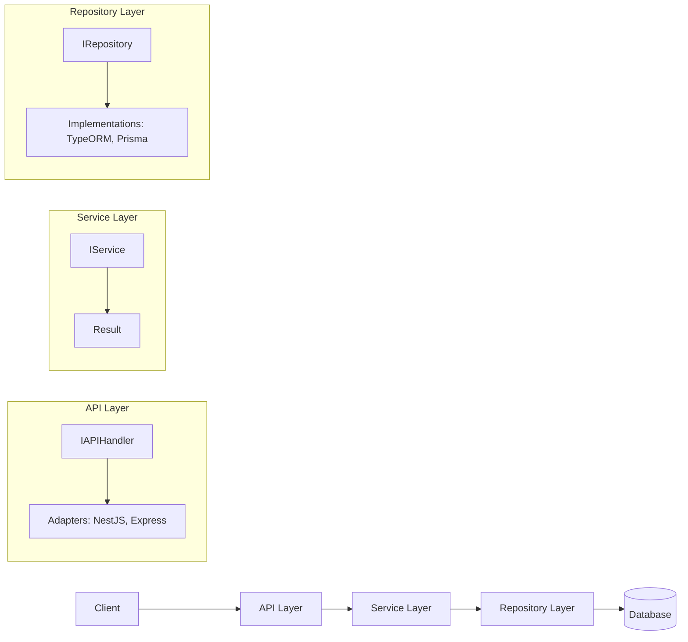

# ignix-core 🚀
A TypeScript package for building type-safe, extensible services with Result pattern, ORM-agnostic repositories, and framework-flexible API handlers.

---

## Table of Contents
- [About](#about)
- [Features](#features)
- [Tech Stack](#tech-stack)
- [Architecture](#architecture)
- [Installation](#installation)
- [Usage](#usage)
- [Contributing](#contributing)
- [License](#license)
- [Contact](#contact)

---

## About
ignix-core solves the problem of repetitive boilerplate in backend development by providing a modular, type-safe architecture for services, data access, and API layers. It enables developers to build scalable applications with robust error handling (using the Result pattern), extensible repositories compatible with popular ORMs like TypeORM or Prisma, and API handlers that adapt to frameworks such as NestJS, Express, Fastify, or Hono. Born from the need for clean, testable code without framework lock-in, it promotes SOLID principles and type safety to reduce bugs and improve maintainability.

---

## Features
- **Result Pattern Integration**: Handle operations with explicit success/failure types, avoiding exceptions and improving reliability.
- **Generic Services**: `IService<T>` with CRUD operations, customizable DTOs (Create, Update, Response), and extensible error types.
- **ORM-Agnostic Repositories**: `IRepository<T>` interface with base implementations for TypeORM, Prisma, and more, allowing easy extension.
- **Framework-Flexible API Handlers**: `IAPIHandler<T>` with adapters for NestJS (controllers) and Express-like (routes), supporting multiple request/response patterns.
- **Type Safety First**: Full TypeScript generics for entities, DTOs, and errors, with discriminated unions for error handling.
- **Extensibility**: Users can override defaults, add custom methods, or integrate new ORMs/frameworks without modifying core code.
- **Legacy Compatibility**: Includes wrappers for promise-based APIs if Result pattern isn't desired.

---

## Tech Stack
- **Language**: TypeScript
- **Package Manager**: npm
- **ORM Support**: TypeORM, Prisma, Sequelize (extensible)
- **Framework Adapters**: NestJS, Express, Fastify, Hono
- **Dev Tools**: Jest (for testing), ESLint, Prettier

---

## Architecture
ignix-core follows a layered architecture inspired by Clean Architecture, separating concerns into Service (business logic), Repository (data access), and API (presentation) layers. This ensures testability, flexibility, and framework independence.



- **Service Layer**: Core business logic with Result pattern for error handling.
- **Repository Layer**: Abstract data access, with concrete implementations per ORM.
- **API Layer**: Handlers that map HTTP requests to services, with adapters for different frameworks.
- Key Decisions: Generics for type safety, discriminated unions for errors, and interfaces for extensibility.

---

## Installation

```bash
npm install ignix-core
```

Or with yarn:
```bash
yarn add ignix-core
```

---

## Usage

### Basic Service Setup
```typescript
import { IService, Result, ok, fail } from 'ignix-core';

// Define your entity
interface User {
  id: number;
  name: string;
  email: string;
}

// Custom DTOs (optional)
type CreateUserDto = Omit<User, 'id'>;
type UpdateUserDto = Partial<User>;
type UserResponseDto = Pick<User, 'id' | 'name'>;

// Implement service
class UserService implements IService<User, CreateUserDto, UpdateUserDto, UserResponseDto> {
  // Implement methods, e.g.
  async findAll(): Promise<Result<UserResponseDto[], ServiceError>> {
    // Your logic here
    return ok([]);
  }
  // ... other methods
}
```

### Repository with TypeORM
```typescript
import { IRepository, TypeOrmRepository } from 'ignix-core';
import { Repository } from 'typeorm';

const typeOrmRepo = new TypeOrmRepository<User>(entityManager.getRepository(User));
const service = new UserService(typeOrmRepo);
```

### API Handler for Express
```typescript
import { IAPIHandler, BaseAPIHandler, createExpressRoutes } from 'ignix-core';

class UserAPIHandler extends BaseAPIHandler<User, CreateUserDto, UpdateUserDto, UserResponseDto> {
  // Customize if needed
}

const handler = new UserAPIHandler(service);
const app = express();
createExpressRoutes(handler, app, '/users');
```

For NestJS, extend the handler in a controller class.

See the `/examples` folder for full implementations.

---

## Contributing

We welcome contributions! To get started:
1. Fork the repo and clone it.
2. Install dependencies: `npm install`.
3. Run tests: `npm test`.
4. Create a feature branch: `git checkout -b feature/your-feature`.
5. Follow our coding standards: Use TypeScript strict mode, add tests for new features, and ensure Result pattern for error handling.
6. Submit a PR with a clear description.

- **Bug Fixes**: Open an issue first.
- **Features**: Discuss in issues before implementing.
- **Style**: Follow ESLint config; prefer functional patterns over classes where possible.
- Encourage PRs for new ORM adapters or framework support!

---

## License

This project is licensed under the MIT License - see the [LICENSE](LICENSE) file for details.

---

## Contact

- **Maintainer**: Johny (Senior Architect, GDE, MVP)
- **Email**: johny@example.com (placeholder)
- **GitHub Issues**: For bugs or features
- **Discord**: Join our community at [discord.gg/ignix](https://discord.gg/ignix) (placeholder)

---

*Made with ❤️ for passionate developers who hate mediocrity.*