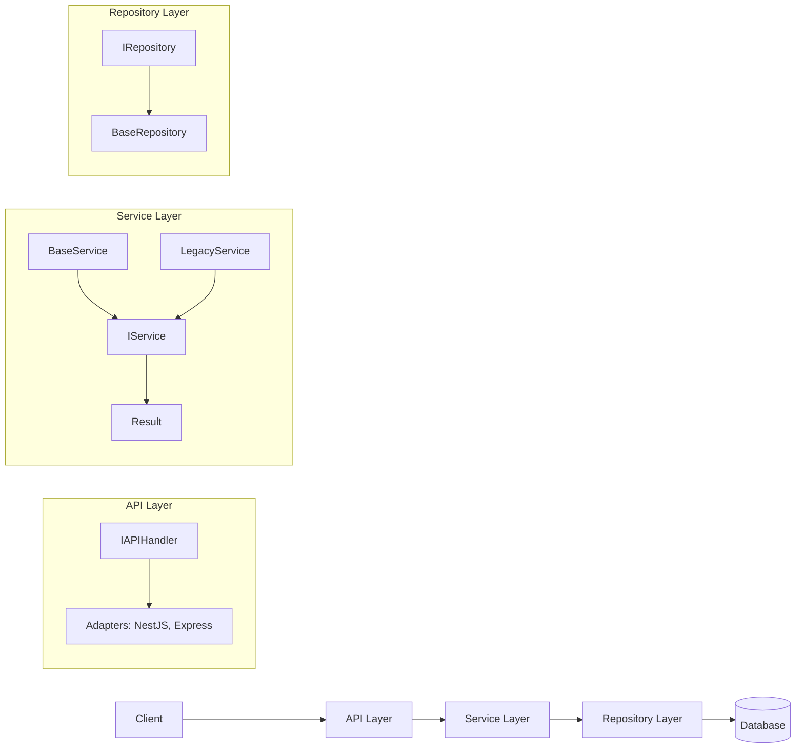

# @ignix/core 🚀
A TypeScript package for building type-safe, extensible services with Result pattern, ORM-agnostic repositories, and framework-flexible API handlers.

---

## Table of Contents
- [About](#about)
- [Features](#features)
- [Tech Stack](#tech-stack)
- [Architecture](#architecture)
- [Installation](#installation)
- [Usage](#usage)
- [Contributing](#contributing)
- [License](#license)
- [Contact](#contact)

---

## About
@ignix/core solves the problem of repetitive boilerplate in backend development by providing a modular, type-safe architecture for services, data access, and API layers. It enables developers to build scalable applications with robust error handling (using the Result pattern), extensible repositories compatible with popular ORMs like TypeORM or Prisma, and API handlers that adapt to frameworks such as NestJS, Express, Fastify, or Hono. Born from the need for clean, testable code without framework lock-in, it promotes SOLID principles and type safety to reduce bugs and improve maintainability.

---

## Features
- **Result Pattern Integration**: Handle operations with explicit success/failure types, avoiding exceptions and improving reliability.
- **Generic Services**: `IService<T>` with CRUD operations, customizable DTOs (Create, Update, Response), and extensible error types. Includes `BaseService` implementation.
- **ORM-Agnostic Repositories**: `IRepository<T>` interface with base implementations for TypeORM, Prisma, and more, allowing easy extension.
- **Framework-Flexible API Handlers**: `IAPIHandler<T>` with adapters for NestJS (controllers) and Express-like (routes), supporting multiple request/response patterns.
- **Legacy Compatibility**: `LegacyService` wrapper for promise-based APIs if Result pattern isn't desired.
- **Type Safety First**: Full TypeScript generics for entities, DTOs, and errors, with discriminated unions for error handling.
- **Extensibility**: Users can override defaults, add custom methods, or integrate new ORMs/frameworks without modifying core code.

---

## Tech Stack
- **Language**: TypeScript
- **Package Manager**: npm
- **ORM Support**: TypeORM, Prisma, Sequelize (extensible)
- **Framework Adapters**: NestJS, Express, Fastify, Hono
- **Dev Tools**: Jest (for testing), ESLint, Prettier

---

## Architecture
@ignix/core follows a layered architecture inspired by Clean Architecture, separating concerns into Service (business logic), Repository (data access), and API (presentation) layers. This ensures testability, flexibility, and framework independence.



- **Service Layer**: Core business logic with Result pattern for error handling. `BaseService` provides a ready-to-use implementation.
- **Repository Layer**: Abstract data access, with `BaseRepository` as extensible base class.
- **API Layer**: Handlers that map HTTP requests to services, with adapters for different frameworks.
- Key Decisions: Generics for type safety, discriminated unions for errors, and interfaces for extensibility.

---

## Installation

```bash
npm install @ignix/core
```

Or with yarn:
```bash
yarn add @ignix/core
```

---

## Usage

### Quick Start with BaseService
```typescript
import { BaseService, IRepository, BaseRepository } from '@ignix/core';

// Define your entity
interface User {
  id: number;
  name: string;
  email: string;
}

// Implement repository (extend BaseRepository for your ORM)
class UserRepository extends BaseRepository<User> {
  constructor(ormClient: any) {
    super(ormClient);
  }
  // Implement abstract methods for your ORM
}

// Create service
const repo = new UserRepository(ormClient);
const service = new BaseService<User>(repo);

// Use service
const result = await service.findAll();
if (result.type === 'success') {
  console.log(result.data);
} else {
  console.error(result.error.message);
}
```

### Custom Service with DTOs
```typescript
import { IService, Result, BaseService } from '@ignix/core';

type CreateUserDto = Omit<User, 'id'>;
type UpdateUserDto = Partial<User>;
type UserResponseDto = Pick<User, 'id' | 'name'>;

class UserService extends BaseService<User, CreateUserDto, UpdateUserDto, UserResponseDto> {
  // Override methods if needed
  async mapToResponse(entity: User): Promise<UserResponseDto> {
    return { id: entity.id, name: entity.name };
  }
}
```

### Legacy Service for Promise-Based Code
```typescript
import { LegacyService } from '@ignix/core';

const legacyService = new LegacyService<User, CreateUserDto, UpdateUserDto, UserResponseDto>(service);

try {
  const users = await legacyService.findAll();
  console.log(users);
} catch (error) {
  console.error(error.message);
}
```

### API Handler for Express
```typescript
import { IAPIHandler, BaseAPIHandler } from '@ignix/core';

class UserAPIHandler extends BaseAPIHandler<User, CreateUserDto, UpdateUserDto, UserResponseDto> {}

const handler = new UserAPIHandler(service);
// Use with Express adapter (when implemented)
```

See the `/examples` folder for full implementations.

---

## Contributing

We welcome contributions! To get started:
1. Fork the repo and clone it.
2. Install dependencies: `npm install`.
3. Run tests: `npm test`.
4. Create a feature branch: `git checkout -b feature/your-feature`.
5. Follow our coding standards: Use TypeScript strict mode, add tests for new features, and ensure Result pattern for error handling.
6. Submit a PR with a clear description.

- **Bug Fixes**: Open an issue first.
- **Features**: Discuss in issues before implementing (e.g., new ORM adapters).
- **Style**: Follow ESLint config; prefer functional patterns over classes where possible.
- **Publishing**: The package is scoped as `@ignix/core`; ensure compatibility when adding features.

---

## License

This project is licensed under the MIT License - see the [LICENSE](LICENSE) file for details.

---

## Contact

- **Maintainer**: Johny (Senior Architect, GDE, MVP)
- **Email**: johny@example.com (placeholder)
- **GitHub Issues**: For bugs or features
- **Discord**: Join our community at [discord.gg/ignix](https://discord.gg/ignix) (placeholder)

---

*Made with ❤️ for passionate developers who hate mediocrity.*